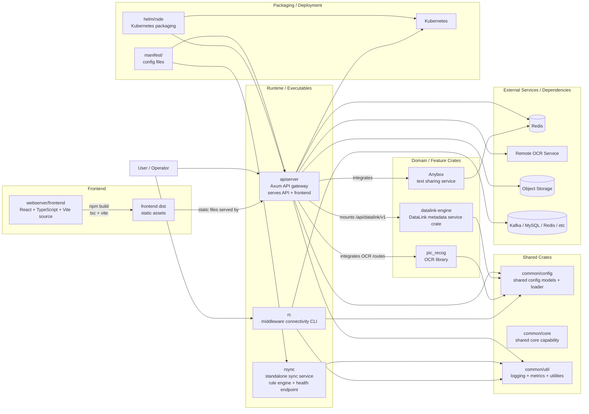

# rsde 项目架构图

## 1. 文档目的

本文档使用 Mermaid 沉淀 rsde 仓库的高层架构图，帮助快速理解：

- 仓库中的主要可执行程序与业务 crate
- `apiserver` 作为统一装配入口的角色
- `common/*` 共享 crate 的位置
- frontend 构建产物与 API 服务的关系
- Helm / Kubernetes 在部署层的位置

本文档只描述**项目级高层结构**，不展开到函数、类、DTO 或单个模块内部实现细节。

---

## 2. 高层架构图

---

## 3. 组件说明

### 3.1 `apiserver`

- 项目的统一 HTTP 入口。
- 在 `apiserver/src/main.rs` 中加载 `GlobalConfig`，初始化日志、指标、中间件，并启动 Axum 服务。
- 在 `apiserver/src/lib.rs` 中装配各类 API 路由，并在 frontend 产物存在时同时提供静态页面服务。

它当前承担的是**组合根（composition root）**角色，而不是单一业务 crate。

### 3.2 `webserver/frontend`

- frontend 基于 React + TypeScript + Vite。
- `package.json` 中的构建脚本是 `tsc && vite build`。
- 构建产物输出到 `webserver/frontend/dist`，由 `apiserver` 直接提供静态服务。

所以前端并不是一个单独部署的 Node 服务，而是一个**构建后由 Rust 服务托管的静态站点**。

### 3.3 `datalink-engine`

- 独立 workspace crate。
- 负责 DataLink 元数据登记、查询、状态流转与声明式 `ApplyDataLink` 能力。
- 在 `apiserver` 中按配置挂载到 `/api/datalink/v1`。

它代表的是：**独立领域能力 crate + apiserver 路由集成** 这类模式。

### 3.4 `anybox`

- 文本分享服务 crate。
- 由 `apiserver` 集成到 `/api/anybox/*`。
- 其后端存储依赖 Redis。

### 3.5 `pic_recog`

- OCR 能力库。
- 当前主要提供 Remote OCR 统一接口。
- 由 `apiserver` OCR 路由接入实际服务能力。

### 3.6 `rsync`

- 独立运行的同步服务。
- 自带 rule engine、文件监听与 `/health` 健康检查接口。
- 不依赖 `apiserver` 作为运行前提，是仓库中的另一个独立可执行程序。

### 3.7 `rc`

- 面向开发/测试场景的 CLI 工具。
- 当前主打 Kafka / MySQL / Redis 等中间件连通性测试和调试。
- 它更像一个**运维/联调工具**，而不是面向最终用户的在线服务。

### 3.8 `common/*`

- `common/config`：统一配置结构与加载入口
- `common/core`：共享核心能力
- `common/util`：日志、指标与通用工具

这些 crate 共同构成仓库的**共享基础层**，为多个可执行程序和业务 crate 提供复用能力。

### 3.9 `helm/rsde` 与 Kubernetes

- `helm/rsde` 是 `apiserver` 为主的部署打包入口。
- frontend、API、Anybox、OCR、对象存储等运行时能力最终通过 Helm / Kubernetes 进入集群环境。

因此部署层不直接改变业务边界，但决定了项目的**最终运行承载方式**。

---

## 4. 关键关系总结

### 4.1 组合关系

- `apiserver` 是主装配入口。
- 它根据配置决定是否挂载 `anybox`、`prompt`、`object_storage`、`datalink-engine`、`nodemanage` 等能力。

### 4.2 构建关系

- `webserver/frontend` 先通过 Node.js 工具链构建。
- 产物不是单独运行，而是交给 `apiserver` 托管。

### 4.3 共享依赖关系

- `common/config` 是跨服务共享配置入口。
- `common/util` 为日志、metrics 等横切能力提供复用。

### 4.4 外部依赖关系

- `anybox` 依赖 Redis。
- `pic_recog` 依赖远程 OCR 服务。
- `apiserver` 可选依赖对象存储。
- `rc` 用于直接连接各类外部中间件。

### 4.5 部署关系

- `manifest/` 提供配置文件。
- `helm/rsde` 把运行时配置和镜像组织成 K8s 可部署单元。

---

## 5. 阅读建议

如果想继续往下看，建议按以下顺序理解仓库：

1. 先看 `README.md`，建立整体仓库视图。
2. 再看 `apiserver/src/main.rs` 和 `apiserver/src/lib.rs`，理解统一装配入口。
3. 然后按兴趣深入各独立 crate：`datalink-engine`、`anybox`、`pic_recog`、`rsync`、`rc`。
4. 最后再看 `helm/rsde` 和 `manifest/`，理解部署与配置承载方式。

这样更容易从“项目级结构”过渡到“模块级实现”。
