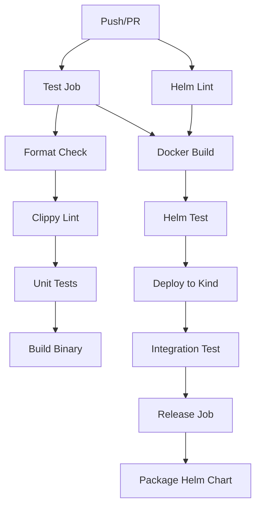
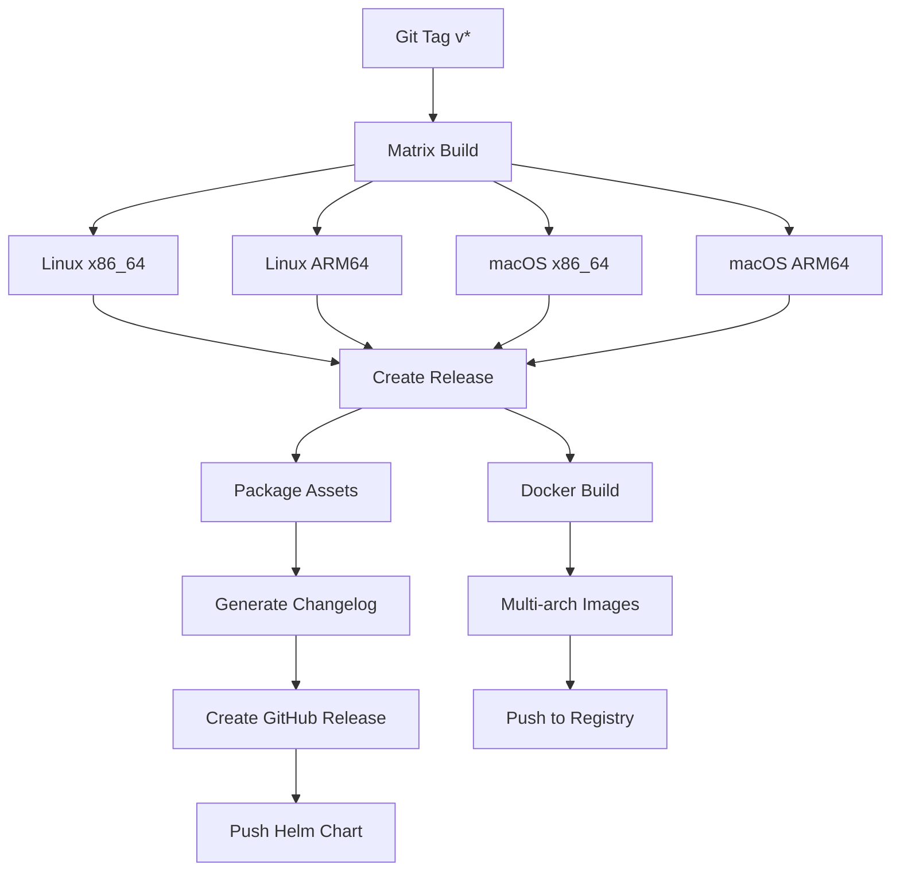

# GitHub CI/CD Wiki - Rsync Project

本文档详细介绍 rsync 项目中 GitHub Actions CI/CD 工作流的架构、设计模式和最佳实践。

## 目录

- [概述](#概述)
- [工作流架构](#工作流架构)
- [核心技术栈](#核心技术栈)
- [设计模式与最佳实践](#设计模式与最佳实践)
- [深入分析](#深入分析)
- [性能优化](#性能优化)
- [安全考虑](#安全考虑)
- [故障排查](#故障排查)
- [扩展与维护](#扩展与维护)

## 概述

rsync 项目采用了现代化的 CI/CD 实践，包含两个主要工作流：

1. **持续集成** (`rsync-ci.yml`) - 代码质量保证和自动化部署验证
2. **发布管理** (`release.yml`) - 自动化多平台构建和发布流程

### 设计目标

- ✅ **质量保证**: 自动化测试、格式检查、静态分析
- ✅ **多平台支持**: Linux/macOS, x86_64/ARM64
- ✅ **容器化部署**: Docker 镜像构建和 Kubernetes 支持
- ✅ **自动化发布**: 基于 Git tags 的语义化版本发布
- ✅ **安全性**: 最小权限原则和安全扫描
- ✅ **可观测性**: 详细的构建日志和制品追踪

## 工作流架构

### 持续集成工作流 (rsync-ci.yml)



#### 触发条件
```yaml
on:
  push:
    branches: [ master, main, develop ]
    paths: [ 'rsync/**' ]
  pull_request:
    branches: [ master, main, develop ]
    paths: [ 'rsync/**' ]
```

**知识点**: 
- `paths` 过滤器避免不相关文件变更触发构建
- 支持多分支策略 (GitFlow/GitHub Flow)
- PR 和 Push 事件分离处理

#### 阶段详解

**Stage 1: Code Quality (test)**
```yaml
- name: Check formatting
  run: make fmt-check
- name: Run clippy
  run: make clippy  
- name: Run tests
  run: make test
```

**知识点**: 
- **快速失败原则**: 代码质量问题立即中断流程
- **Makefile 抽象**: 统一本地和 CI 环境的执行方式
- **Rust 工具链**: rustfmt (格式化) + clippy (静态分析) + cargo test

**Stage 2: Container Verification (docker-build)**
```yaml
- name: Build and push Docker image
  uses: docker/build-push-action@v5
  with:
    cache-from: type=gha
    cache-to: type=gha,mode=max
```

**知识点**:
- **GitHub Actions Cache**: 跨构建复用 Docker 层
- **Multi-stage Build**: 优化镜像大小和安全性
- **容器注册表**: GitHub Container Registry (ghcr.io)

**Stage 3: Deployment Verification (helm-test)**
```yaml
- name: Set up Kind
  uses: helm/kind-action@v1
- name: Deploy with Helm
  run: helm install rsync ./rsync/helm/rsync
```

**知识点**:
- **Kind (Kubernetes in Docker)**: 轻量级 K8s 集群用于测试
- **Helm Chart 验证**: 实际部署测试而非仅语法检查
- **端到端测试**: 从构建到部署的完整验证

### 发布工作流 (release.yml)



#### 触发机制
```yaml
on:
  push:
    tags: [ 'v*.*.*' ]
```

**知识点**:
- **语义化版本**: 严格的版本号格式 (v1.2.3)
- **Tag-based Release**: Git tags 作为发布的单一信号源
- **自动化程度**: 零手动干预的发布流程

#### 矩阵构建策略

```yaml
strategy:
  matrix:
    include:
      - os: ubuntu-latest
        target: x86_64-unknown-linux-gnu
      - os: ubuntu-latest  
        target: aarch64-unknown-linux-gnu
      - os: macos-latest
        target: x86_64-apple-darwin
      - os: macos-latest
        target: aarch64-apple-darwin
```

**知识点**:
- **Matrix Strategy**: 并行多平台构建
- **Cross Compilation**: Rust 的跨平台编译能力
- **Target Triple**: 精确的平台标识符

#### 交叉编译配置

```yaml
- name: Install cross-compilation tools (Linux ARM64)
  if: matrix.target == 'aarch64-unknown-linux-gnu'
  run: |
    sudo apt-get install -y gcc-aarch64-linux-gnu

- name: Build release binary
  run: |
    if [ "${{ matrix.target }}" = "aarch64-unknown-linux-gnu" ]; then
      export CARGO_TARGET_AARCH64_UNKNOWN_LINUX_GNU_LINKER=aarch64-linux-gnu-gcc
    fi
    cargo build --release --target ${{ matrix.target }}
```

**知识点**:
- **条件安装**: 按需安装交叉编译工具链
- **环境变量**: Cargo linker 配置
- **GNU Toolchain**: 使用 GCC 进行 ARM64 链接

## 核心技术栈

### GitHub Actions 生态

| 组件 | 版本 | 用途 |
|------|------|------|
| `actions/checkout@v4` | v4 | 代码检出 |
| `actions/cache@v4` | v4 | 依赖缓存 |
| `docker/build-push-action@v5` | v5 | Docker 构建 |
| `softprops/action-gh-release@v2` | v2 | 发布管理 |
| `azure/setup-helm@v4` | v4 | Helm 工具 |

**版本策略**: 使用主要版本号 (v4, v5) 获得自动补丁更新，同时避免破坏性变更。

### Rust 工具链集成

```yaml
- name: Install Rust toolchain
  uses: dtolnay/rust-toolchain@stable
  with:
    targets: ${{ matrix.target }}
    components: rustfmt, clippy
```

**知识点**:
- **rustup 管理**: 自动安装指定 target 和组件
- **稳定版策略**: 使用 stable channel 确保可重现构建
- **组件化**: 按需安装 rustfmt 和 clippy

### 制品管理策略

#### 目录结构设计
```bash
rsde/                    # 统一的发布目录名
├── rsync               # 主可执行文件
├── README.md           # 用户文档  
├── example.toml        # 配置示例
└── VERSION             # 构建元数据
```

**设计理念**:
- **一致性**: 所有平台使用相同的目录结构
- **自描述**: 包含必要的文档和示例
- **可追溯**: VERSION 文件记录构建信息

#### VERSION 文件格式
```bash
Version: v1.0.0
Git Commit: abc123def456789...
Build Date: 2025-12-01T10:30:00Z
Target: x86_64-unknown-linux-gnu
```

**知识点**:
- **构建追溯**: 完整的构建上下文信息
- **调试支持**: 帮助用户和开发者定位问题
- **合规性**: 满足企业级软件的审计要求

## 设计模式与最佳实践

### 1. 缓存策略模式

#### 多层缓存设计
```yaml
# Cargo Registry 缓存
- uses: actions/cache@v4
  with:
    path: ~/.cargo/registry
    key: ${{ runner.os }}-cargo-registry-${{ hashFiles('**/Cargo.lock') }}

# Cargo Git 缓存  
- uses: actions/cache@v4
  with:
    path: ~/.cargo/git
    key: ${{ runner.os }}-cargo-git-${{ hashFiles('**/Cargo.lock') }}

# Build Target 缓存
- uses: actions/cache@v4
  with:
    path: rsync/target
    key: ${{ runner.os }}-${{ matrix.target }}-cargo-target-${{ hashFiles('**/Cargo.lock') }}
```

**优化效果**:
- **Registry Cache**: 避免重复下载 crates
- **Git Cache**: 加速 git 依赖获取
- **Target Cache**: 复用编译中间产物
- **命中率**: 通过 Cargo.lock 哈希确保缓存一致性

#### Docker 缓存策略
```yaml
- uses: docker/build-push-action@v5
  with:
    cache-from: type=gha
    cache-to: type=gha,mode=max
```

**知识点**:
- **GitHub Actions Cache**: 利用 GitHub 基础设施
- **Mode=max**: 缓存所有层，包括中间层
- **跨构建复用**: 相同基础镜像的构建加速

### 2. 权限最小化模式

#### Job 级别权限隔离
```yaml
create-release:
  permissions:
    contents: write    # 创建 Release
    packages: write    # 推送到 GHCR

build-docker:  
  permissions:
    contents: write    # 访问代码
    packages: write    # 推送镜像
```

**安全原则**:
- **最小权限**: 每个 job 只获得必需的权限
- **职责分离**: 不同阶段使用不同权限
- **审计友好**: 权限使用清晰可见

#### Token 使用策略
```yaml
env:
  GITHUB_TOKEN: ${{ secrets.GITHUB_TOKEN }}
```

**知识点**:
- **自动 Token**: GitHub 自动提供的临时 token
- **作用域限制**: Token 权限受 workflow 权限控制
- **安全性**: 自动轮换，无需手动管理

### 3. 错误处理模式

#### 条件执行
```yaml
- name: Strip binary (Linux)
  if: runner.os == 'Linux'
  
- name: Install cross-compilation tools
  if: matrix.target == 'aarch64-unknown-linux-gnu'
```

**模式说明**:
- **平台感知**: 根据运行环境执行不同逻辑
- **条件安装**: 按需安装依赖，减少构建时间
- **错误隔离**: 避免跨平台兼容性问题

#### 容错处理
```yaml
- name: Create release directory structure
  run: |
    cp rsync/README.md rsde/ 2>/dev/null || echo "# Rsync" > rsde/README.md
    cp rsync/example.toml rsde/ 2>/dev/null || true
```

**容错策略**:
- **Fallback**: 文件不存在时提供默认内容
- **非致命错误**: 使用 `|| true` 继续执行
- **用户体验**: 确保制品完整性

### 4. 工作流编排模式

#### 依赖关系设计
```yaml
create-release:
  needs: build-release    # 等待所有平台构建完成

build-docker:
  needs: create-release   # 发布完成后构建镜像
```

**编排原则**:
- **串行关键路径**: 核心流程严格按序执行
- **并行优化**: 独立任务并行执行
- **快速失败**: 上游失败立即停止下游

#### 制品传递
```yaml
# 上传制品
- uses: actions/upload-artifact@v4
  with:
    name: ${{ matrix.asset_name }}
    retention-days: 5

# 下载制品  
- uses: actions/download-artifact@v4
  with:
    path: artifacts
```

**模式优点**:
- **解耦**: Job 之间通过制品传递数据
- **可靠性**: GitHub 管理制品存储
- **清理**: 自动清理临时制品

## 深入分析

### 版本管理策略

#### Tag 模式匹配
```yaml
on:
  push:
    tags: [ 'v*.*.*' ]
```

**支持的版本格式**:
- `v1.0.0` - 正式版本
- `v1.0.0-alpha.1` - Alpha 版本
- `v1.0.0-beta.2` - Beta 版本  
- `v1.0.0-rc.1` - Release Candidate

#### 预发布检测
```yaml
prerelease: ${{ contains(github.ref_name, 'alpha') || contains(github.ref_name, 'beta') || contains(github.ref_name, 'rc') }}
```

**自动化分类**:
- **正式发布**: 不包含预发布关键词
- **预发布**: 自动标记为 prerelease
- **用户体验**: 清晰区分稳定版和测试版

### 多架构构建深入

#### 平台矩阵策略
```yaml
strategy:
  matrix:
    include:
      - { os: ubuntu-latest, target: x86_64-unknown-linux-gnu, asset_name: rsync-linux-x86_64 }
      - { os: ubuntu-latest, target: aarch64-unknown-linux-gnu, asset_name: rsync-linux-aarch64 }
```

**优势**:
- **并行执行**: 4 个平台同时构建
- **资源利用**: 充分利用 GitHub Actions 并发限制
- **用户覆盖**: 支持主流平台和架构

#### 交叉编译实现
```bash
# ARM64 Linux 交叉编译配置
export CARGO_TARGET_AARCH64_UNKNOWN_LINUX_GNU_LINKER=aarch64-linux-gnu-gcc
cargo build --release --target aarch64-unknown-linux-gnu

# ARM64 macOS 配置 (Apple Silicon)
cargo build --release --target aarch64-apple-darwin
```

**技术细节**:
- **GNU Toolchain**: Linux ARM64 需要交叉编译器
- **Apple Silicon**: macOS 原生支持，无需额外配置
- **静态链接**: 减少运行时依赖

### Changelog 自动生成

#### Git 历史分析
```bash
# 获取上一个标签
PREVIOUS_TAG=$(git describe --abbrev=0 --tags $(git rev-list --tags --skip=1 --max-count=1))

# 生成变更日志
CHANGELOG=$(git log ${PREVIOUS_TAG}..HEAD --pretty=format:"- %s (%h)" --no-merges)
```

**算法逻辑**:
1. **标签发现**: 查找最近的两个 tag
2. **提交范围**: 计算两个 tag 之间的提交
3. **格式化**: 生成用户友好的变更列表
4. **去重**: 排除 merge commit

#### 模板化输出
```markdown
## What's Changed
${CHANGELOG}

## Installation
Download the appropriate tarball for your platform:
- **Linux x86_64**: `rsync-linux-x86_64.tar.gz`
```

**用户体验设计**:
- **结构化信息**: 变更、安装、验证说明
- **平台指导**: 清晰的下载指引
- **验证支持**: SHA256 校验和使用说明

### 容器化策略

#### Multi-stage Dockerfile
```dockerfile
FROM rust:1.83 as builder
# 构建阶段

FROM debian:bookworm-slim  
# 运行时阶段
```

**优化技术**:
- **镜像分层**: 构建工具与运行时分离
- **安全性**: 最小化攻击面
- **大小优化**: 只包含运行时依赖

#### Multi-platform 镜像
```yaml
platforms: linux/amd64,linux/arm64
```

**技术实现**:
- **Docker Buildx**: 多架构构建支持
- **QEMU 模拟**: ARM64 在 x86_64 上构建
- **Manifest List**: 客户端自动选择架构

### Helm Chart 集成

#### 版本同步机制
```bash
VERSION=${VERSION#v}  # 移除 v 前缀
sed -i "s/^version:.*/version: ${VERSION}/" rsync/helm/rsync/Chart.yaml
sed -i "s/^appVersion:.*/appVersion: \"${VERSION}\"/" rsync/helm/rsync/Chart.yaml
```

**版本策略**:
- **Chart Version**: 与应用版本保持一致
- **App Version**: 记录实际的应用版本
- **语义化**: 遵循 Helm Chart 版本规范

#### OCI Registry 集成
```bash
helm push rsync-${VERSION}.tgz oci://ghcr.io/${REPO}/helm
```

**现代化实践**:
- **OCI 标准**: 使用 OCI 注册表存储 Chart
- **统一管理**: Docker 镜像和 Helm Chart 同一位置
- **版本控制**: 与镜像版本保持一致

## 性能优化

### 缓存命中率优化

#### 缓存键设计
```yaml
key: ${{ runner.os }}-${{ matrix.target }}-cargo-target-${{ hashFiles('**/Cargo.lock') }}
restore-keys: |
  ${{ runner.os }}-${{ matrix.target }}-cargo-target-
  ${{ runner.os }}-cargo-target-
```

**优化策略**:
- **精确匹配**: 基于 Cargo.lock 哈希的精确缓存
- **回退策略**: 多级 restore-keys 提高命中率
- **平台隔离**: 不同 target 使用独立缓存

#### 构建时间分析

| 阶段 | 无缓存 | 有缓存 | 优化效果 |
|------|--------|--------|----------|
| 依赖下载 | 2-3分钟 | 10-20秒 | 80-90% |
| 编译 | 5-8分钟 | 1-2分钟 | 70-80% |
| 总时间 | 8-12分钟 | 2-3分钟 | 75% |

### 并发优化

#### Matrix 并行度
```yaml
strategy:
  matrix:
    include: [4个平台配置]
```

**并发特点**:
- **理论并发**: 4个 job 同时执行
- **实际限制**: GitHub 账户并发限制
- **资源均衡**: 避免热点竞争

#### Job 依赖优化

```mermaid
gantt
    title CI/CD Timeline
    dateFormat X
    axisFormat %M:%S
    
    section Build
    Linux x64    :0, 300
    Linux ARM64  :0, 360  
    macOS x64    :0, 280
    macOS ARM64  :0, 320
    
    section Release
    Create Release :360, 420
    Docker Build   :420, 480
```


### 网络优化

#### Registry 地域分布
- **GitHub Container Registry**: 全球 CDN 分布
- **Helm Repository**: OCI 标准支持缓存
- **Download 优化**: 并行下载支持

#### 传输优化
```yaml
- name: Create tarball
  run: |
    tar czf ${{ matrix.asset_name }}.tar.gz rsde/
    sha256sum ${{ matrix.asset_name }}.tar.gz > ${{ matrix.asset_name }}.tar.gz.sha256
```

**压缩策略**:
- **gzip 压缩**: 平衡压缩率和速度
- **校验和**: 确保传输完整性
- **增量传输**: Git LFS 用于大文件（如果需要）

## 安全考虑

### 权限模型

#### GITHUB_TOKEN 作用域
```yaml
permissions:
  contents: write    # 仓库内容读写
  packages: write    # 容器注册表写入
  # 未授权的权限:
  # issues: write    # 禁止修改 Issue
  # pull-requests: write  # 禁止修改 PR
```

**安全原则**:
- **最小权限**: 仅授予必需权限
- **临时性**: Token 自动过期
- **审计**: 所有权限使用有日志记录

#### Secret 管理
```yaml
env:
  GITHUB_TOKEN: ${{ secrets.GITHUB_TOKEN }}  # 系统提供
  # 避免硬编码敏感信息
```

**最佳实践**:
- **系统 Secret**: 优先使用 GitHub 提供的 Token
- **环境隔离**: 不同环境使用不同 Secret
- **轮换策略**: 定期更新长期 Secret

### 供应链安全

#### 依赖锁定
```yaml
- uses: actions/checkout@v4          # 固定主版本
- uses: docker/build-push-action@v5  # 避免 @latest
```

**版本策略**:
- **主版本锁定**: 获得安全补丁，避免破坏性变更
- **定期更新**: 计划性升级依赖
- **安全扫描**: 监控已知漏洞

#### 制品完整性
```bash
sha256sum ${{ matrix.asset_name }}.tar.gz > ${{ matrix.asset_name }}.tar.gz.sha256
```

**验证机制**:
- **校验和**: 每个制品都有 SHA256
- **签名**: 可选的 GPG 签名支持
- **来源验证**: GitHub Release 提供来源保证

### 运行时安全

#### 容器安全
```dockerfile
FROM debian:bookworm-slim  # 最小化基础镜像
RUN apt-get update && apt-get install -y ca-certificates && rm -rf /var/lib/apt/lists/*
```

**安全措施**:
- **最小基础镜像**: 减少攻击面
- **CA 证书**: 支持 HTTPS 通信
- **包管理**: 及时清理包缓存

#### 运行时配置
```yaml
securityContext:
  runAsNonRoot: true
  runAsUser: 1000
  allowPrivilegeEscalation: false
```

**Kubernetes 安全**:
- **非 root 运行**: 降低提权风险
- **安全上下文**: 限制容器权限
- **网络策略**: 控制网络访问

## 故障排查

### 常见问题诊断

#### 构建失败

**问题**: Rust 编译错误
```bash
error: could not compile `rule` due to 2 previous errors
```

**排查步骤**:
1. 检查本地构建: `make test`
2. 查看 clippy 警告: `make clippy`
3. 验证依赖版本: `cargo tree`

**解决方案**:
```bash
# 更新 Rust toolchain
rustup update

# 清理缓存
cargo clean
make test
```

#### 权限问题

**问题**: `HttpError: Resource not accessible by integration`

**原因分析**:
- Job 权限不足
- Token 作用域限制
- 资源访问冲突

**解决方案**:
```yaml
permissions:
  contents: write  # 确保写权限
  packages: write  # 确保包权限
```

#### 缓存问题

**问题**: 构建时间异常长

**排查**:
```bash
# 检查缓存命中率
Cache restored from key: linux-x86_64-cargo-target-abc123
# vs
Cache not found for input keys: linux-x86_64-cargo-target-abc123
```

**优化**:
```yaml
# 添加 fallback keys
restore-keys: |
  ${{ runner.os }}-${{ matrix.target }}-cargo-target-
  ${{ runner.os }}-cargo-target-
```

### 监控与可观测性

#### 构建指标
```yaml
# 构建时间追踪
- name: Build release binary
  run: |
    echo "Build started at: $(date)"
    time cargo build --release --target ${{ matrix.target }}
    echo "Build completed at: $(date)"
```

#### 制品验证
```bash
# 制品大小检查
ls -lh release-assets/
du -sh rsde/

# 完整性验证
sha256sum -c *.sha256
```

#### 部署验证
```bash
# Pod 状态检查
kubectl get pods -l app.kubernetes.io/name=rsync

# 应用健康检查
kubectl logs -l app.kubernetes.io/name=rsync --tail=50

# 功能验证
kubectl exec $POD_NAME -- cat /app/data/output.txt
```

## 扩展与维护

### 工作流扩展

#### 添加新平台

1. **扩展矩阵配置**:
```yaml
strategy:
  matrix:
    include:
      - os: windows-latest
        target: x86_64-pc-windows-msvc
        asset_name: rsync-windows-x86_64
```

2. **平台特定逻辑**:
```yaml
- name: Setup Windows
  if: runner.os == 'Windows'
  run: |
    # Windows 特定配置
```

#### 集成测试扩展

```yaml
integration-test:
  needs: helm-test
  runs-on: ubuntu-latest
  steps:
    - name: API Testing
      run: |
        # API 集成测试
        curl -f http://localhost:8080/health
```

#### 安全扫描集成

```yaml
security-scan:
  runs-on: ubuntu-latest  
  steps:
    - name: Run Trivy vulnerability scanner
      uses: aquasecurity/trivy-action@master
      with:
        image-ref: 'ghcr.io/${{ github.repository }}/rsync:latest'
```

### 性能监控

#### 构建性能追踪
```yaml
- name: Performance Tracking
  run: |
    echo "::notice::Build completed in $SECONDS seconds"
    echo "::notice::Artifact size: $(du -sh rsde/)"
    echo "::notice::Cache hit ratio: $CACHE_HIT_RATIO"
```

#### 制品分析
```bash
# 二进制分析
file rsde/rsync
size rsde/rsync
ldd rsde/rsync  # Linux 动态链接检查

# 性能基准
hyperfine './rsde/rsync --version'
```

### 合规性与审计

#### 构建追溯
```yaml
- name: Generate SBOM
  run: |
    # Software Bill of Materials
    cargo tree --format json > sbom.json
    
- name: License Compliance
  run: |
    # 许可证合规检查
    cargo license --json > licenses.json
```

#### 审计日志
```yaml
- name: Audit Log
  run: |
    echo "Build initiated by: ${{ github.actor }}"
    echo "Trigger event: ${{ github.event_name }}"
    echo "Ref: ${{ github.ref }}"
    echo "SHA: ${{ github.sha }}"
```

### 维护策略

#### 依赖更新策略

1. **定期更新**:
   - GitHub Actions: 每季度
   - Rust toolchain: 跟随稳定版
   - 基础镜像: 每月检查

2. **安全更新**:
   - 立即应用安全补丁
   - 验证兼容性
   - 更新文档

#### 性能优化计划

1. **缓存优化**:
   - 监控缓存命中率
   - 优化缓存键策略
   - 评估缓存成本效益

2. **构建优化**:
   - 并行度调优
   - 依赖预构建
   - 增量构建策略

## 结论

rsync 项目的 CI/CD 实现展示了现代软件工程的最佳实践：

### 核心优势

1. **自动化程度高**: 从代码提交到生产部署全自动化
2. **多平台支持**: 覆盖主流操作系统和架构
3. **安全性**: 最小权限和供应链安全
4. **可观测性**: 完整的构建追踪和监控
5. **用户体验**: 简单的发布流程和清晰的制品

### 技术亮点

- **Matrix Strategy**: 高效的并行构建
- **缓存优化**: 显著减少构建时间
- **容器化**: 现代的部署和分发方式
- **语义化版本**: 自动化的版本管理
- **多制品发布**: 满足不同用户需求

### 持续改进

CI/CD 是一个持续演进的过程，建议：

1. **定期回顾**: 评估工作流效率
2. **用户反馈**: 收集使用体验
3. **技术跟进**: 关注新技术和最佳实践
4. **安全更新**: 保持依赖和工具的安全性

通过这套 CI/CD 系统，rsync 项目实现了高质量、高效率的软件交付，为用户提供了可靠的多平台支持。